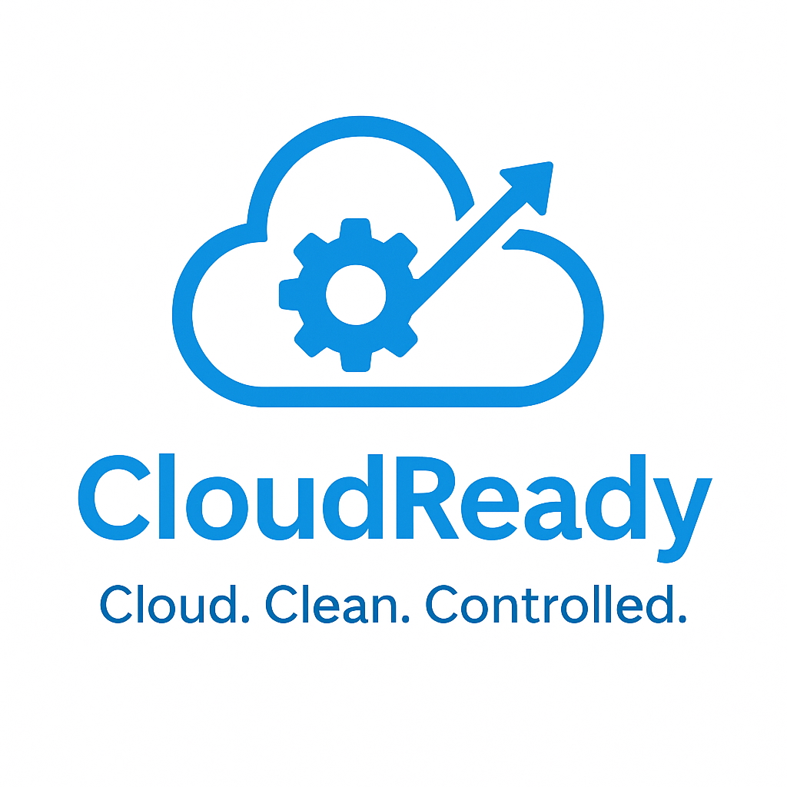

# CloudReady ☁️⚙️

**Cloud. Clean. Controlled.**

CloudReady is a plug-and-play Azure toolkit for startups, small teams, and cloud engineers who want to launch secure, cost-effective, production-ready infrastructure on Azure in minutes.



---

## 🚀 Features

- 🏗️ Production-Grade Azure Landing Zone (Terraform)
- 💰 Cost Monitoring Alerts via Azure Budgets + Functions
- 🧹 Auto-Cleanup of unused/stale dev resources
- 📊 Pre-configured Monitoring Stack (App Insights, Prometheus, Grafana)
- 🔄 CI/CD Pipelines (GitHub Actions for IaC)

---

## 📦 Modules

| Module          | Description                                      |
|-----------------|--------------------------------------------------|
| `landing-zone`  | Deploys VNETs, NSGs, Key Vault, Diagnostics etc. |
| `cost-watcher`  | Azure Budgets + Alerts + Slack integration       |
| `auto-cleanup`  | Scheduled removal of expired resources           |

---

## 🛠️ Quick Start

```bash
git clone https://github.com/gowrisha-cloud/cloudready.git
cd cloudready/modules/landing-zone

terraform init
terraform apply -var-file=dev.tfvars